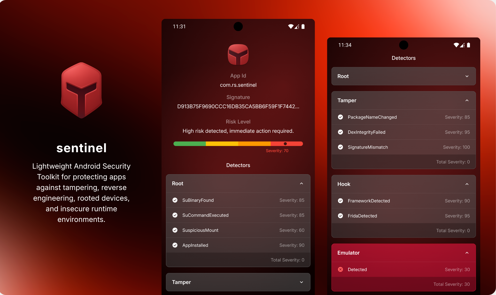

<div align="center">

<p align="center">
  
</p>

[-000000?style=for-the-badge&logo=kotlin)](#)
[](https://developer.android.com/)
[]((https://developer.apple.com/))

[](#)
[](#)
[](#)
[](#)

Lightweight Android Security Toolkit for protecting apps against tampering, reverse engineering,
rooted devices, and insecure runtime environments.

<!--
<a href="https://play.google.com/store/apps/details?id=com.rs.sentinel.app">
    
</a>
-->

<p align="center">
  
</p>

</div>
<br>

## Sentinel

**Sentinel** is a lightweight, modular Android security toolkit designed to analyze runtime
environments and detect potential security threats in real time.

It helps protect your application against:

- Rooted devices
- App tampering
- Hooking frameworks
- Emulators
- Debugging sessions
- Mock location abuse

Sentinel performs deep environmental inspection, calculates a unified **risk severity score**, and
produces a comprehensive security report.

## Features

♦️ **Modular Detector Architecture:** Easily enable, disable, or extend security checks.  
♦️ **Unified Risk Scoring System:** Aggregate all threats into a single severity score.  
♦️ **Configurable Threat Threshold:** Set your own critical risk level to control app behavior.  
♦️ **DSL-Based Configuration:** Use a clean and expressive API for configuration.  
♦️ **Detailed Security Reports:** Get a full breakdown of detected threats.  
♦️ **Lightweight & High Performance:** Minimal runtime overhead for optimal performance.

## Getting Started

Sentinel uses a centralized DSL configuration to manage all security checks.

```gradle
implementation("com.github.ResulSilay:Sentinel:1.0.0-alpha01")
```

```kotlin
val sentinel = Sentinel.configure(context = context) {
    /* config {
        this.packageName = packageName.toByteList()
        this.packageSignature = packageSignature.toByteList()
        this.threshold = 80
    } */

    all()
    // root()
    // tamper()
    // hook()
    // emulator()
    // debug()
    // location()
}
```

Instead of basic checks, Sentinel performs a thorough inspection of the environment and provides a
detailed report based on threat severity.

```kotlin
val report = sentinel.inspect()

println("----- Security Report -----")
println("Risk Level: ${report.riskLevel}")
println("Severity Score: ${report.severity}")
println("Threat Count: ${report.threats.size}")
println("Timestamp: ${report.timestamp}")

if (report.isRooted) println("❌ Root detected")
if (report.isTampered) println("❌ App tampering detected")
if (report.isHooked) println("❌ Hooking detected")
if (report.isEmulator) println("❌ Emulator detected")
if (report.isDebuggable) println("❌ Debugger detected")
if (report.isMockLocation) println("❌ Mock location detected")

if (report.isSafe()) {
    println("✅ Device is secure")
} else {
    println("⚠️ Security risks detected!")
}

if (report.isCritical()) {
    println("🚫 Block app usage.")
}
```

## Installation

Add JitPack repository:

```gradle
dependencyResolutionManagement {
    repositories {
        maven { url "https://jitpack.io" }
    }
}
```

Include the library in your **app module** `build.gradle`:

```gradle
implementation("com.github.ResulSilay:Sentinel:1.0.0-alpha01")
```

## License

```
MIT License

Copyright (c) 2026 Resul Silay

Permission is hereby granted, free of charge, to any person obtaining a copy
of this software and associated documentation files (the "Software"), to deal
in the Software without restriction, including without limitation the rights
to use, copy, modify, merge, publish, distribute, sublicense, and/or sell
copies of the Software, and to permit persons to whom the Software is
furnished to do so, subject to the following conditions:

The above copyright notice and this permission notice shall be included in all
copies or substantial portions of the Software.

THE SOFTWARE IS PROVIDED "AS IS", WITHOUT WARRANTY OF ANY KIND, EXPRESS OR
IMPLIED, INCLUDING BUT NOT LIMITED TO THE WARRANTIES OF MERCHANTABILITY,
FITNESS FOR A PARTICULAR PURPOSE AND NONINFRINGEMENT. IN NO EVENT SHALL THE
AUTHORS OR COPYRIGHT HOLDERS BE LIABLE FOR ANY CLAIM, DAMAGES OR OTHER
LIABILITY, WHETHER IN AN ACTION OF CONTRACT, TORT OR OTHERWISE, ARISING FROM,
OUT OF OR IN CONNECTION WITH THE SOFTWARE OR THE USE OR OTHER DEALINGS IN THE
SOFTWARE.
```